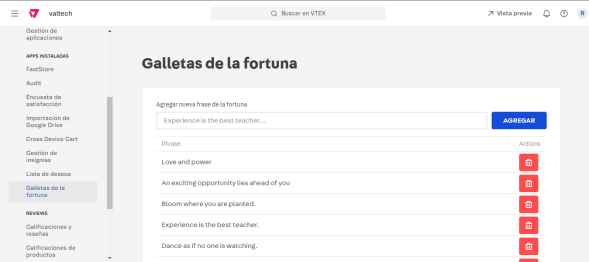

# Challenge
Este repositorio contiene el challenge para Valtech.
Para la realización del desafío se desarrollaró un componente custom (ChineseCookiesComponent) el cuál contiene un botón para visualizar de manera aleatoria una frase de las galletas de la fortuna almacenadas en Master Data.
Para ello, se realizó una petición a la entidad “CF” y se creó un middleware para no exponer sus api key y token. La landing se encuentra en https://challengerodrigoblanca0--valtech.myvtex.com/chinese-cookies . 
Por otro lado, se desarrollo una Admin app, la cuál permite visualizar en el admin, todas los registros de las galletas de la fortuna en master data, como a su vez, agregar una nueva. Se puede visualizar en https://challengerodrigoblanca0--valtech.myvtex.com/admin/chinese-cookies .

Algunas capturas del desarrollo

# Store theme
<!-- ALL-CONTRIBUTORS-BADGE:START - Do not remove or modify this section -->

<!-- ALL-CONTRIBUTORS-BADGE:END -->
Our boilerplate theme to create stores in the VTEX IO platform.

## Preview

## Tutorial
To understand how things work check our tutorial [Build a store using VTEX IO](https://vtex.io/docs/getting-started/build-stores-with-store-framework/1/)

## Dependencies
All store components that you see on this document are open source too. Production ready, you can found those apps in this GitHub organization.

Store framework is the baseline to create any store using _VTEX IO Web Framework_.
- [Store](https://github.com/vtex-apps/store/blob/master/README.md)

Store GraphQL is a middleware to access all VTEX APIs.
- [Store GraphQL](https://github.com/vtex-apps/store-graphql/blob/master/docs/README.md)

### Store Component Apps
- [Header](https://github.com/vtex-apps/store-header/blob/master/docs/README.md)
- [Footer](https://github.com/vtex-apps/store-footer/blob/master/docs/README.md)
- [Slider Layout](https://github.com/vtex-apps/slider-layout/blob/master/docs/README.md)
- [Shelf](https://github.com/vtex-apps/shelf/blob/master/docs/README.md)
- [Telemarketing](https://github.com/vtex-apps/telemarketing/blob/master/docs/README.md)
- [Menu](https://github.com/vtex-apps/menu/blob/master/docs/README.md)
- [Login](https://github.com/vtex-apps/login/blob/master/docs/README.md)
- [Minicart](https://github.com/vtex-apps/minicart/blob/master/docs/README.md)
- [Category Menu](https://github.com/vtex-apps/category-menu/blob/master/docs/README.md)
- [Product Summary](https://github.com/vtex-apps/product-summary/blob/master/docs/README.md)
- [Breadcrumb](https://github.com/vtex-apps/breadcrumb/blob/master/docs/README.md)
- [Search Result](https://github.com/vtex-apps/search-result/blob/master/docs/README.md)
- [Product Details](https://github.com/vtex-apps/product-details/blob/master/docs/README.md)
- [Store Components](https://github.com/vtex-apps/store-components/blob/master/docs/README.md)
- [Order Placed](https://github.com/vtex-apps/order-placed/blob/master/docs/README.md) 

### Store Pixel Apps

 - [Facebook Pixel](https://github.com/vtex-apps/facebook-pixel/blob/master/docs/README.md)
 - [Google Tag Manager](https://github.com/vtex-apps/google-tag-manager/blob/master/docs/README.md)

## Contributing

Check it out [how to contribute](https://github.com/vtex-apps/awesome-io#contributing) with this project.

## Contributors ✨

Thanks goes to these wonderful people ([emoji key](https://allcontributors.org/docs/en/emoji-key)):

<!-- ALL-CONTRIBUTORS-LIST:START - Do not remove or modify this section -->
<!-- prettier-ignore-start -->
<!-- markdownlint-disable -->
<table>
  <tr>
    <td align="center"><a href="http://www.hugoccosta.com"> <b>Hugo Costa</b></a> <a href="https://github.com/vtex-apps/store-theme/commits?author=hugocostadev" title="Documentation">📖</a></td>
  </tr>
</table>

<!-- markdownlint-enable -->
<!-- prettier-ignore-end -->
<!-- ALL-CONTRIBUTORS-LIST:END -->

This project follows the [all-contributors](https://github.com/all-contributors/all-contributors) specification. Contributions of any kind welcome!
